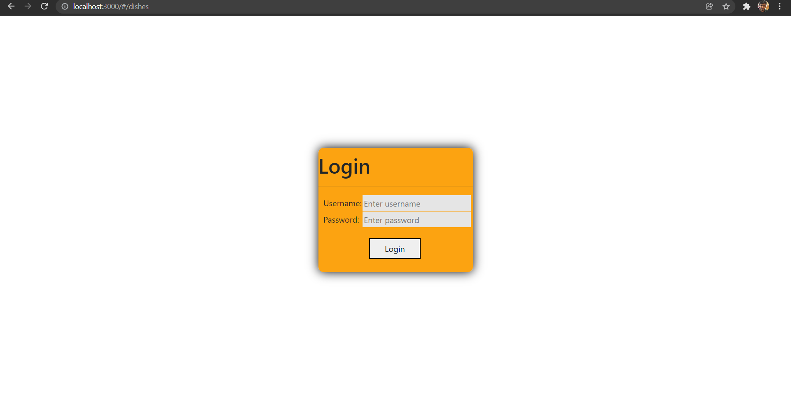
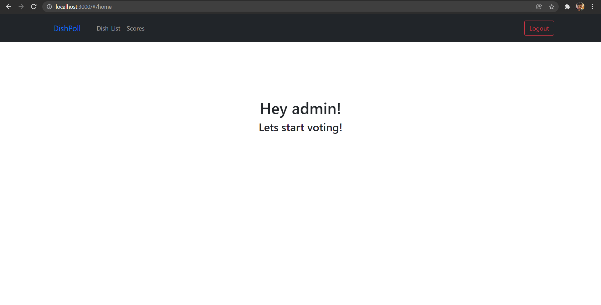
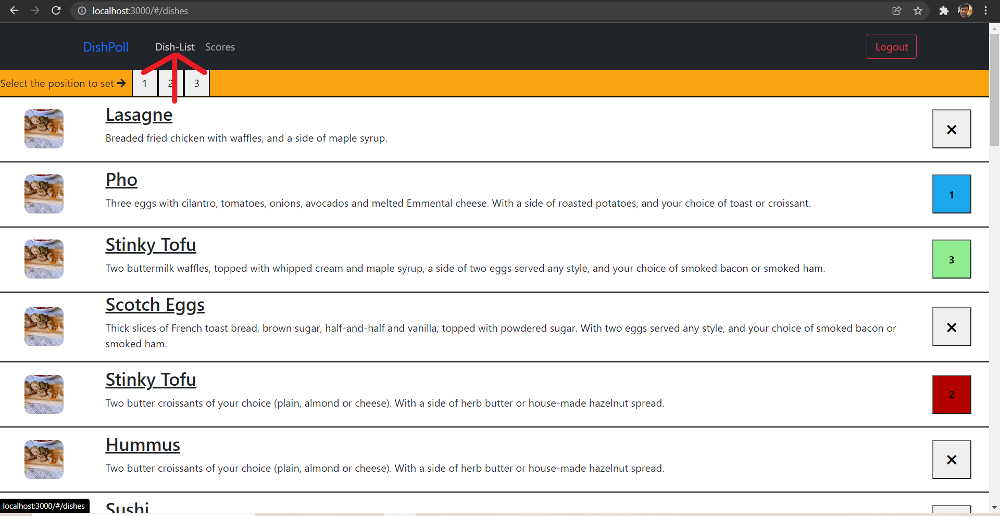
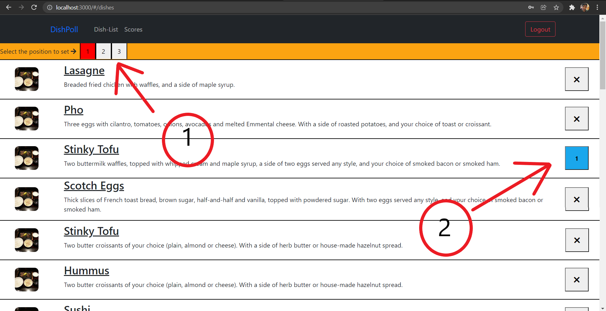
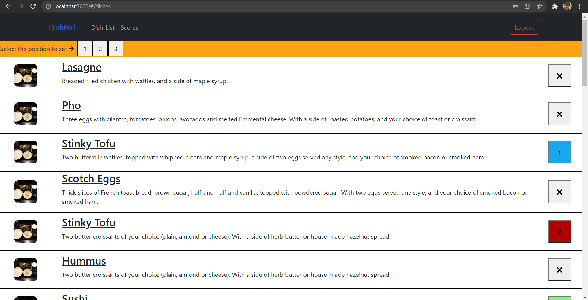
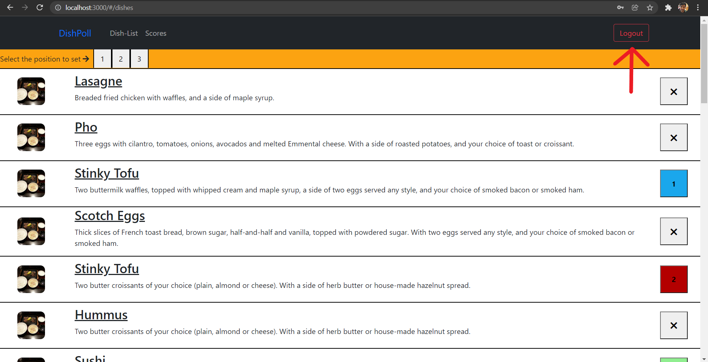
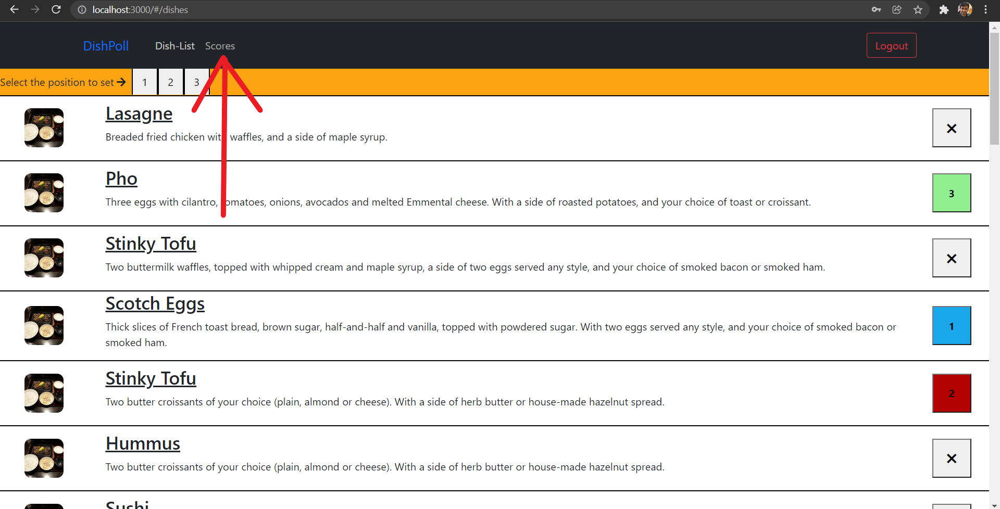
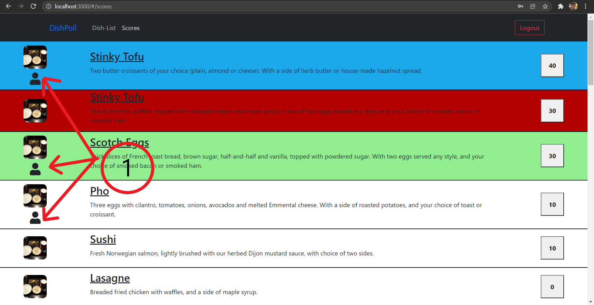

<h1>DishPoll by Amey Bairolu</h1>

<h3>Link: </h3>

<h3>Tools used</h3>

<ol>
<li></li>
<li></li>
<li></li>
</ol>

<h3>Steps to run the project</h3>

<ol>
    <li>Download the project from the respository.</li>
    <li>Extract the .zip file.</li>
    <li>Use any Editor of your choice and open the folder containing all files.</li>
    <li>Make sure you have NPM installed</li>
    <li>Open terminal in the folder's directory and run "npm install". Wait for files to get downloaded.</li>
    <li>now use "npm start" command to locally run project.</li>
</ol>

<h3>Points covered in the project</h3>

<ol>
    <li>
    
Logging in/Logging out. For username and password, kindly refer src/store/storeIndex.js.

    <ol>
    <li>username: admin, password: admin</li>
    <li>username: ronaldo, password: admin</li>
    <li>username: light, password: admin</li>
    <li>username: loki, password: admin</li>
    </ol>
    
    </li>
    <li>
    
 Once you successfully login, the below picture will be displayed.
    

    
    </li>
    <li>
    
 To go to the page with all the dishes, click on "Dish-List" button in NavBar.
    

    
    </li>
    <li>
    
 To start polling, click on the number as shown in point 1 in the image below. 
    Once either one of the buttons, 1,2,3, is red, click on the 'x button' belonging to the row you want to put the poll in. (Refer the below image again)
    

    
    </li>
    <li>
    
 After successful polling, your screen should look something like this.
    

    
    </li>
    <li>
    
 You can perform polling for other users. By clicking on the logout button as shown in the image below. Logging in again using any of the credentials in point 1.
    

    
    </li>
    <li>
    
 To view the polling results, click on "Scores button" in the NavBar as shown in the picture below.
    

    
    </li>
    <li>
    
 Now to understand polling results,
        <ol>
        <li>Blue row is the dish that got most points</li>
        <li>Red row is the dish that got most 2nd points</li>
        <li>Green row is the dish that got 3rd most points</li>
        <li>One more thing to note, the arrows in the image below denote the rows for which the current logged in user voted. The icon is an indication for the user to note where his dishes are in the list. 
        </li>
        </ol>
    

    
    </li>
    <li>
    

    For understanding the objective of the project, please refer this link <a href="https://github.com/syook/react-dishpoll">Click here</a>
    

    </li>
</ol>
